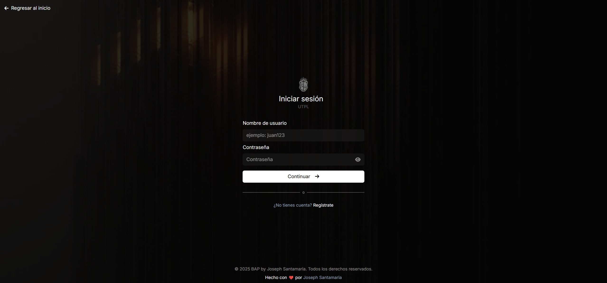

# 🔐 Basic Auth PHP (BAP)
### by Joseph Santamaria
---

> Sistema básico de autenticación de usuarios en PHP puro, con conexión a base de datos MySQL y sin frameworks externos.



---

## 📦 Características

- Registro de usuario con validación
- Inicio de sesión seguro con contraseñas encriptadas (bcrypt)
- Protección contra SQL Injection usando _Prepared Statements_
- Sistema de sesión con redirección automática
- Página de login, registro y dashboard
- Protección para rutas privadas/públicas

---

## ⚙️ Tecnologías

- 🐘 PHP (>=7.4)
- 🐬 MySQL
- 🎨 TailwindCSS (para diseño rápido)
- 📃 HTML5 + CSS3
- 📁 Vanilla JS (mínimo uso)

---

## 📁 Estructura del proyecto

```
/
├── public/
│   └── css/
├── connection.php
├── db.sql
├── functions.php
├── home.php
├── index.php
├── login.php
├── logout.php
└── signup.php
```

---

## 🛠️ Instalación y uso

1. Clona este repositorio:

```bash
git clone https://github.com/JosephASG/php-basic-auth-utpl.git
cd php-basic-auth-utpl
```

2. Importa la base de datos:

```sql
CREATE TABLE usuarios (
    id BIGINT NOT NULL AUTO_INCREMENT PRIMARY KEY,
    user_id BIGINT NOT NULL,
    user_name VARCHAR(255) NOT NULL,
    email VARCHAR(255) NOT NULL,
    password VARCHAR(255) NOT NULL,
    date TIMESTAMP DEFAULT CURRENT_TIMESTAMP
);
```

3. Levanta un servidor local (por ejemplo con PHP):

```bash
php -S localhost:8000
```

4. Abre tu navegador en: [http://localhost:8000](http://localhost:8000)

---

## 🧠 Autor

**Joseph Santamaria**  
Multi-disciplinary Interactive Developer & Designer
🌐 [joseph-san.com](https://joseph-san.com)  
🐦(X) [@JosephSan2301](https://x.com/JosephSan2301)

---

## 📄 Licencia

Este proyecto está bajo la Licencia MIT.

